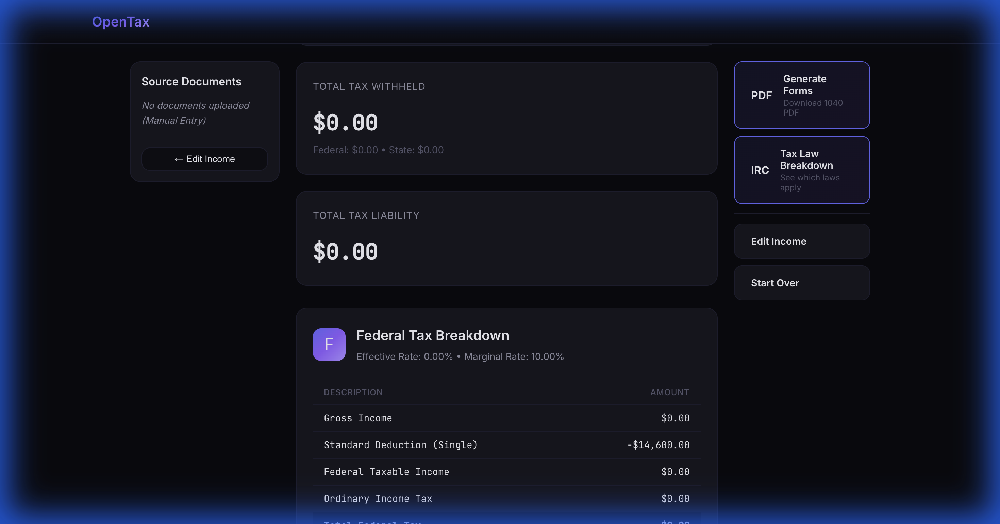
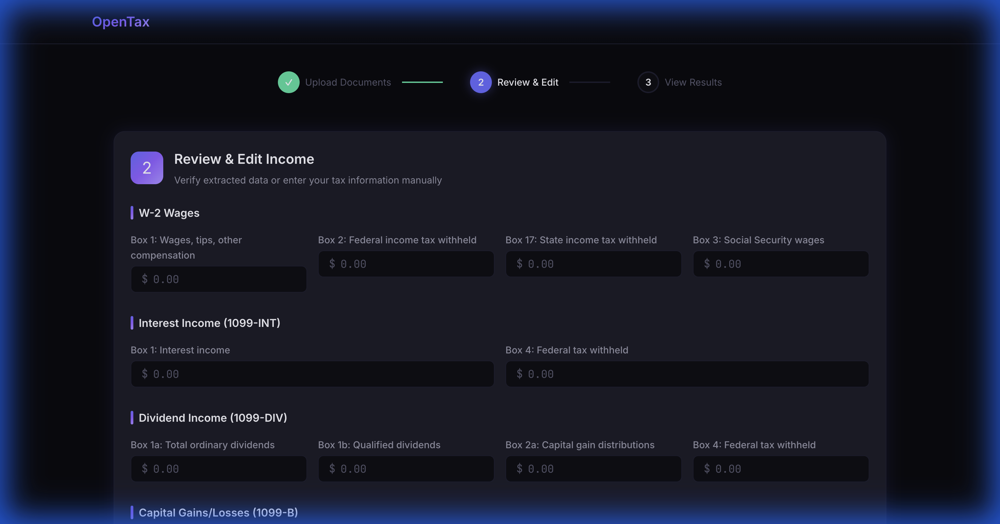
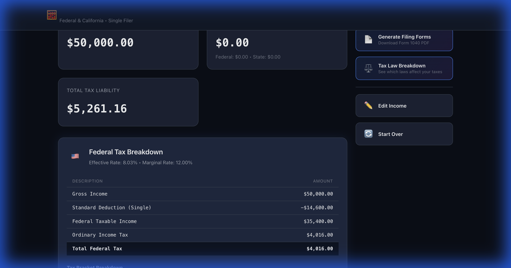
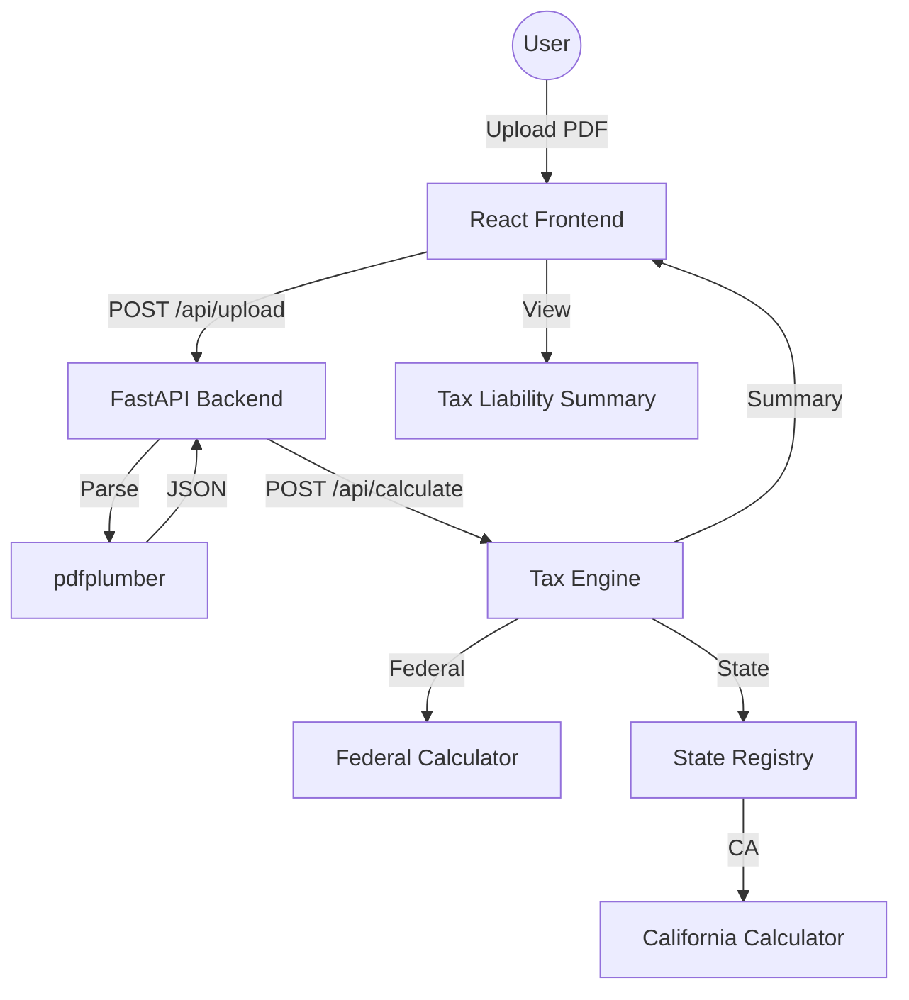

# 🏦 OpenTax

**OpenTax** is an open-source, privacy-first tax estimation platform. It allows users to upload tax documents (W-2s, 1099s), automatically extract data locally, and calculate federal and state tax liabilities without sending sensitive data to the cloud.



> [!IMPORTANT]
> **Privacy First**: All PDF parsing and tax calculations happen on your local machine.

## ✨ Visual Tour

| **Step 1: Upload** | **Step 2: Review** | **Step 3: Results** |
| :--- | :--- | :--- |
|  |  |  |


## 🏗️ Architecture



## 🚀 Getting Started

### ⚡ One-Click Quickstart (For Non-Developers)

The easiest way to run OpenTax is using our automated startup scripts. They will handle installing everything and launching the app in your browser!

**Mac & Linux:**
1. Open your terminal.
2. Navigate to this folder.
3. Run `./start.sh` (or `npm start`)

**Windows:**
1. Double-click `start.bat` in this folder.

---

### 🛠️ Manual Local Setup (For Developers)

#### Prerequisites
- **Python 3.9+**
- **Node.js 18+**

1. **Clone and Install Backend**:
   ```bash
   cd backend
   python -m venv venv
   source venv/bin/activate  # Windows: venv\Scripts\activate
   pip install -r requirements.txt
   python main.py
   ```

2. **Clone and Install Frontend**:
   ```bash
   cd frontend
   npm install
   npm run dev
   ```

3. **Open the App**: Visit [http://localhost:5173](http://localhost:5173)

## 🛠️ Tech Stack

- **Frontend**: React, Vite, Vanilla CSS (Premium Aesthetic)
- **Backend**: Python, FastAPI
- **Parsing**: `pdfplumber` for text extraction
- **Tax Logic**: Custom engine supporting 2024/2025 brackets

## 🤝 Contributing

We welcome contributions! Especially:
- **New State Calculators**: Add support for your state in `backend/tax_engine/states/`
- **Improved Parsers**: Help us support more bank and brokerage formats.

Please read our [CONTRIBUTING.md](CONTRIBUTING.md) for a detailed technical guide.

### Development Workflow

Before submitting a PR, please run the preflight check from the root directory:
```bash
npm run preflight
```
This command runs linting, type checks, and all tests for both frontend and backend.

## 📜 License

Distributed under the **MIT License**. See `LICENSE` for more information.

## ⚖️ Disclaimer

OpenTax is an estimation tool and **not** a substitute for professional tax advice. Always verify your results with a qualified professional.
